# Buzz Architecture and Design System

This is the onboarding map for the Buzz codebase: what runs, how data moves,
where each responsibility lives, and how the user interfaces stay visually
consistent. It intentionally explains the system before diving into individual
functions. The root [`ARCHITECTURE.md`](../../ARCHITECTURE.md) remains the
authoritative detailed reference for relay behavior and protocol limits.

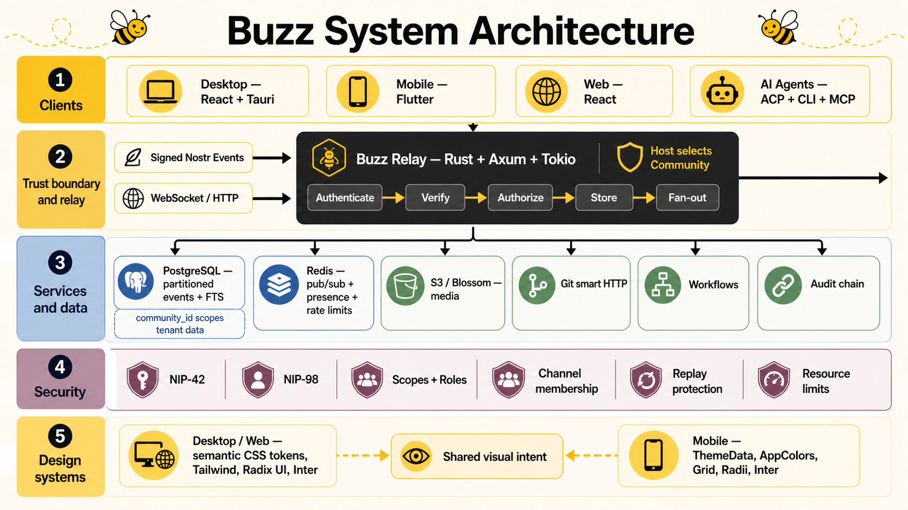

## Diagram files

Every technical diagram is available as editable Mermaid source and as a
polished illustrated infographic matching the main Buzz architecture style.

| Diagram | Editable source | Illustrated infographic |
| --- | --- | --- |
| System overview | [`buzz-system-overview.mmd`](buzz-system-overview.mmd) | [`buzz-system-overview-infographic.png`](buzz-system-overview-infographic.png) |
| Event lifecycle | [`event-lifecycle.mmd`](event-lifecycle.mmd) | [`event-lifecycle-infographic.png`](event-lifecycle-infographic.png) |
| Security boundaries | [`security-boundaries.mmd`](security-boundaries.mmd) | [`security-boundaries-infographic.png`](security-boundaries-infographic.png) |
| Conceptual database design | [`database-design.mmd`](database-design.mmd) | [`database-design-infographic.png`](database-design-infographic.png) |
| Complete table relations | [`database-table-relations.mmd`](database-table-relations.mmd) | [`database-table-relations-infographic.png`](database-table-relations-infographic.png) |
| Agent lifecycle | [`agent-lifecycle.mmd`](agent-lifecycle.mmd) | [`agent-lifecycle-infographic.png`](agent-lifecycle-infographic.png) |
| Deployment ecosystem | [`deployment-ecosystem.mmd`](deployment-ecosystem.mmd) | [`deployment-ecosystem-infographic.png`](deployment-ecosystem-infographic.png) |
| Design-system layers | [`design-system-layers.mmd`](design-system-layers.mmd) | [`design-system-layers-infographic.png`](design-system-layers-infographic.png) |

## 1. Buzz in one minute

Buzz is a self-hosted collaboration platform built on the Nostr event format.
People, applications, automation, and AI agents are all clients of the same
relay. They publish cryptographically signed events and subscribe to events that
match filters.

The relay is the source of truth. It authenticates clients, verifies events,
enforces community and channel boundaries, stores durable events, distributes
live events, indexes searchable content, records audit information, and invokes
workflows. Clients do not exchange events peer to peer.

The repository contains four major product surfaces:

| Surface | Implementation | Role |
| --- | --- | --- |
| Relay and services | Rust, Axum, Tokio | Authoritative server and orchestration layer |
| Desktop | React 19, TypeScript, Tauri 2/Rust | Full native client and local agent host |
| Web | React 19, TypeScript, Vite | Browser client and repository browser |
| Mobile | Flutter, Riverpod, Hooks | Native mobile client |
| Agent/CLI | Rust, ACP/JSON-RPC, MCP | Agent lifecycle, automation, and command-line access |

## 2. Runtime system map

The editable source is [`buzz-system-overview.mmd`](buzz-system-overview.mmd).


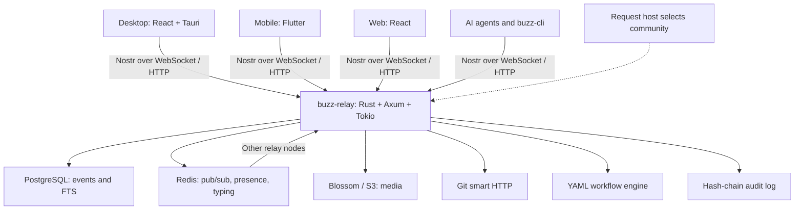

`buzz-relay` is deliberately the coordinator. Service crates depend on shared
types from `buzz-core`, but normally do not call one another. This concentrates
cross-subsystem decisions and propagation of community context in the relay.

## 3. Protocol and domain model

Every operation begins with a Nostr event:

```json
{
  "id": "sha256-of-canonical-event",
  "pubkey": "secp256k1-public-key",
  "kind": 40002,
  "tags": [["h", "channel-uuid"]],
  "content": "Hello from Buzz",
  "sig": "schnorr-signature"
}
```

- `kind` is the dispatch key. It says whether an event is a message, reaction,
  edit, presence update, agent job, workflow transition, or another operation.
- `tags` express relationships and scope. Events inside a channel use an `h`
  tag. Addressable events describing a channel use their `d` tag as the channel
  identifier.
- `pubkey` identifies the author. The signature proves the author controlled
  the corresponding private key and protects event integrity.
- Kinds from `20000` through `29999` are ephemeral and are not stored as event
  history.

The kind registry in [`crates/buzz-core/src/kind.rs`](../../crates/buzz-core/src/kind.rs)
is the backend source of truth. Desktop constants live in
[`desktop/src/shared/constants/kinds.ts`](../../desktop/src/shared/constants/kinds.ts),
and mobile models live in
[`mobile/lib/shared/relay/nostr_models.dart`](../../mobile/lib/shared/relay/nostr_models.dart).

### WebSocket messages

| Direction | Message | Meaning |
| --- | --- | --- |
| Client to relay | `EVENT` | Submit a signed event |
| Client to relay | `REQ` | Register filters and request stored/live events |
| Client to relay | `CLOSE` | Remove a subscription |
| Client to relay | `AUTH` | Answer a NIP-42 authentication challenge |
| Relay to client | `EVENT` | Deliver a matching event |
| Relay to client | `EOSE` | End of stored events for a request |
| Relay to client | `OK` | Accept or reject a submitted event |
| Relay to client | `CLOSED` | Reject or terminate a subscription |

The relay also exposes narrow HTTP surfaces for operations that genuinely need
HTTP: `/events`, `/query`, `/count`, workflow webhooks, Blossom media, Git smart
HTTP, NIP-11/NIP-05 metadata, community/operator actions, and health probes.
New collaborative features should normally be modeled as event kinds instead
of endpoint-specific JSON APIs.

## 4. Connection and event lifecycle

The editable sequence is [`event-lifecycle.mmd`](event-lifecycle.mmd).

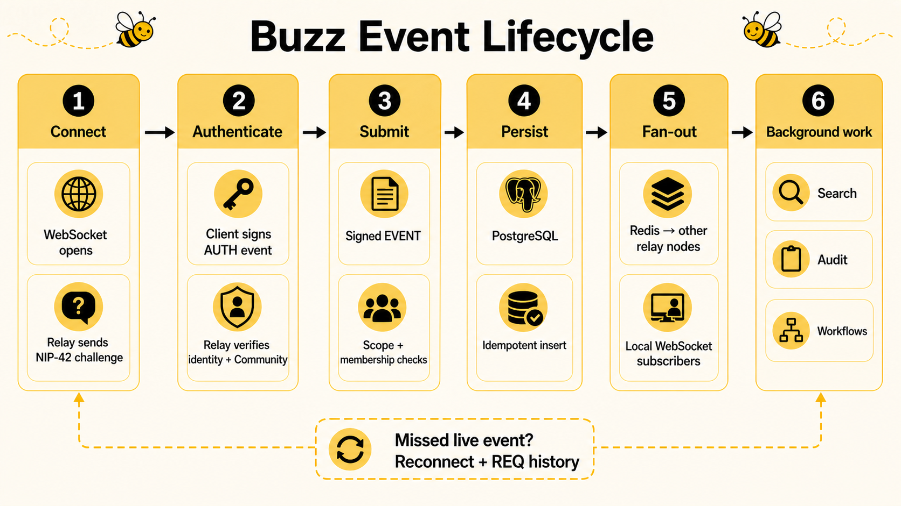

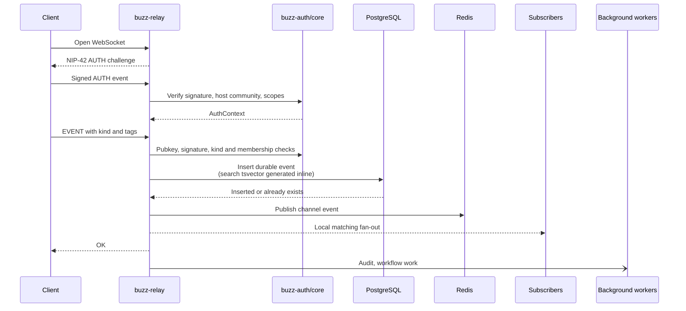

The durable event path is:

1. Confirm authenticated state and required scope.
2. Require the event author to match the authenticated identity.
3. Reject authentication events from normal storage.
4. Verify the event ID and Schnorr signature.
5. Resolve channel scope and enforce membership.
6. Insert idempotently into PostgreSQL.
7. Publish channel events through Redis for other relay nodes.
8. Fan out to matching local subscriptions.
9. Enqueue audit and workflow processing. Search needs no separate step: the
   search `tsvector` is a generated column written with the insert itself.

Ephemeral events skip normal durable storage. Presence updates use Redis
presence state and local delivery. Other ephemeral channel events, including
typing, are membership-checked, published through Redis, and delivered locally.

### Reading and subscriptions

A `REQ` carries one or more Nostr filters. The relay checks channel access
before registering the subscription, queries stored history, sends matching
events, sends `EOSE`, and then continues delivering new matching events.

The subscription registry has indexes for channel-plus-kind and channel
wildcard subscriptions. Global subscriptions are not allowed to receive
private channel events merely because another part of their filter matches.
This is a deliberate data-isolation boundary.

## 5. Communities and security boundaries

A community is the tenant-visible workspace. The request host determines the
community before authentication, event handling, queries, search, media, Git,
workflows, or pub/sub processing. Client-controlled tags cannot override it.
Unknown hosts fail closed.

Security is layered:

- NIP-42 authenticates WebSocket sessions.
- NIP-98 authenticates supported HTTP requests.
- Event signatures protect authorship and content integrity.
- Scopes authorize broad capabilities such as reading or writing messages.
- Community membership and channel membership restrict data access.
- Subscription registration and live fan-out both enforce channel boundaries.
- Media and Git requests retain the same host-derived community context.
- Audit entries form a hash chain, making mutation or deletion detectable.
- Webhook secrets are separate from Nostr client authentication.

The editable trust-boundary diagram is
[`security-boundaries.mmd`](security-boundaries.mmd).

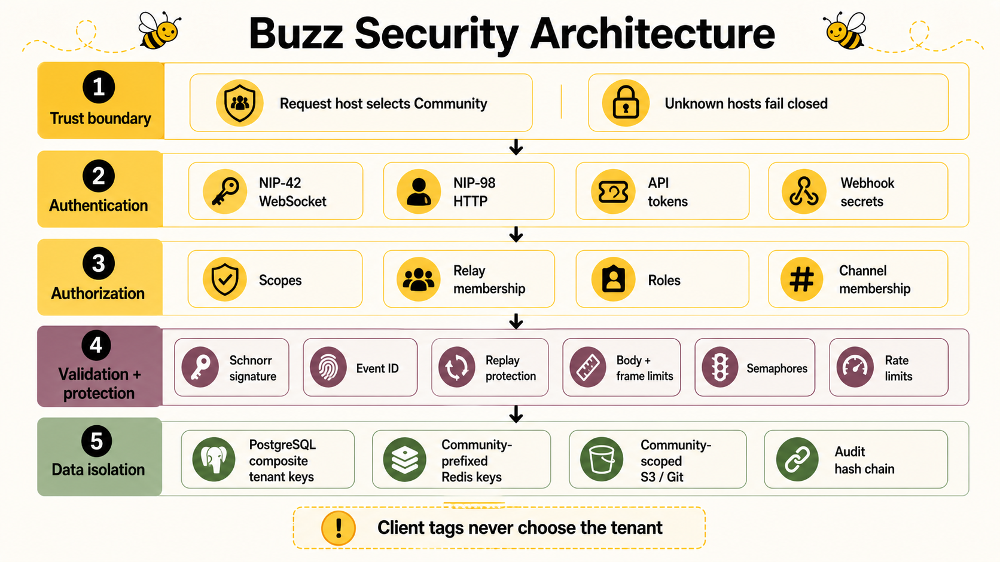

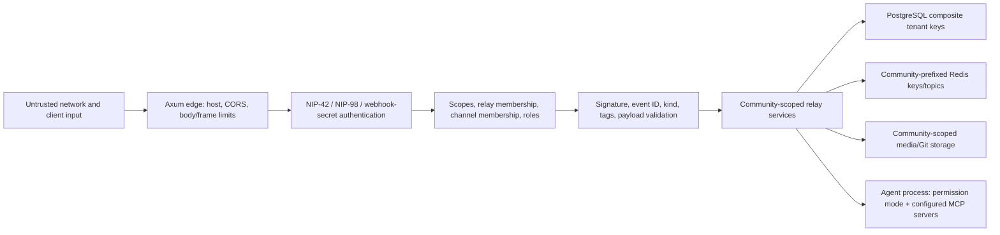

### Authentication mechanisms

| Entry point | Authentication | Important checks |
| --- | --- | --- |
| WebSocket | NIP-42 challenge event | Challenge, signature, relay URL, freshness, community membership |
| Nostr HTTP bridge | NIP-98 signed event | URL, method, payload hash where required, freshness, replay claim |
| API token | Opaque bearer token (data model only; not currently wired as a live edge authenticator) | SHA-256 hash lookup, expiry, revocation, scopes, optional channels |
| Workflow webhook | Per-hook secret | Secret verification and webhook-specific request policy |
| Git/media/operator routes | Route-specific NIP-98 policy | Community binding plus operation-specific scope/role checks |

NIP-98 replay claims are shared through Redis and namespaced by community. API
tokens are stored as 32-byte hashes rather than recoverable bearer values.

### Authorization model

Authentication answers *who is calling*. Authorization then combines several
independent constraints:

1. The request host chooses a `TenantContext`.
2. The authenticated identity receives a set of scopes.
3. Relay membership controls admission to the community.
4. Channel membership and visibility control channel access.
5. Roles such as owner, admin, member, guest, and bot constrain privileged
   mutations.
6. Some event kinds have additional author, recipient (`p` tag), moderation, or
   workflow-specific gates.

Checks occur before subscription registration and again where candidate data is
delivered. Search intentionally returns candidate hits; the relay re-authorizes
them before returning them to a client.

### Input and resource protection

- WebSocket frames, subscriptions, historical results, and HTTP bodies have
  configured limits.
- Connection and handler semaphores cap concurrent work.
- Git and media uploads have their own concurrency controls.
- Slow WebSocket clients are disconnected after repeated full send buffers.
- Event verification checks the canonical hash and Schnorr signature before a
  durable write.
- SQL is parameterized through SQLx; partition DDL uses validated table/date
  allowlists.
- Outbound workflow/webhook behavior applies SSRF-oriented URL restrictions.
- CORS is configured at the relay edge and should be restricted in deployments.
- Redis-backed admission rate limiting and narrower local gates protect selected
  expensive or abuse-prone operations.

### Keys, secrets, and privacy

Client private keys should stay on the client. Desktop uses the operating-system
keyring by default, with a permission-restricted file fallback when that feature
is disabled. The relay has a separate signing key for relay-authored events.
Deployment secrets include database, Redis, object-store, webhook, and signing
credentials and must be supplied through the deployment secret mechanism rather
than committed configuration.

Gift wraps and other privacy-sensitive event kinds are excluded from full-text
search at the database-generated-column level. This does not make all stored
event content encrypted: confidentiality depends on the event kind and protocol.
Operators must treat PostgreSQL, logs, backups, object storage, and observability
exports as sensitive infrastructure.

### Security review checklist

For every new operation, review host/community binding, authentication,
required scope, role and channel gates, event signature and tag validation,
replay/idempotency, query result authorization, Redis key scoping, object-store
prefixes, log redaction, resource limits, SSRF/file-path behavior, and negative
cross-community tests.

For the detailed isolation model, see
[`docs/multi-tenant-relay.md`](../multi-tenant-relay.md).

## 6. Database design

The editable data-model diagram is [`database-design.mmd`](database-design.mmd).
For the complete physical and logical relationship catalog, including every
current migration table, see
[`database-table-relations.md`](database-table-relations.md).

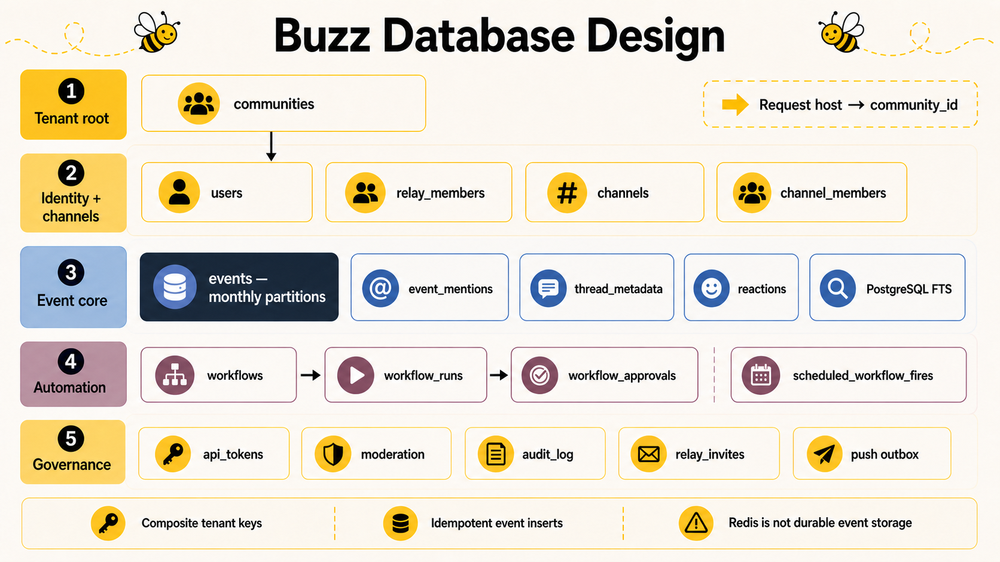

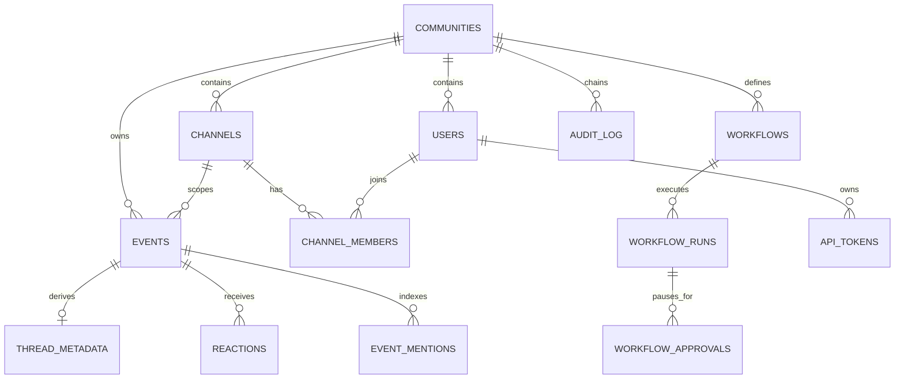

### Tenancy and relational invariants

`communities` is the host registry and is operator-global. Nearly every other
tenant-visible table has a non-null `community_id`. Primary keys, unique indexes,
and foreign keys lead with or carry that community key, allowing the same event,
channel UUID, pubkey, or logical name to exist independently in different
communities.

For example, a channel is identified internally by `(community_id, id)`, and a
channel-member foreign key references that same tuple. A database trigger makes
`channels.community_id` immutable, preventing a channel from being moved between
tenants accidentally.

Isolation is enforced by typed application context, community-scoped queries,
composite constraints, migration linting, and conformance tests. The current
migrations do not define PostgreSQL row-level-security policies, so missing a
community predicate in application code would be a serious defect; composite
keys and query tests are important defense-in-depth, not a reason to omit the
predicate.

### Event storage

`events` is the central append-oriented table. It stores the canonical event
fields plus received time, resolved channel, soft-deletion state, addressable
`d` tag, scheduling fields, and a generated search vector.

- It is range-partitioned by `created_at`, with monthly partitions and catch-all
  past/future partitions.
- The primary key is `(community_id, created_at, id)` because the partition key
  must participate and the same signed event may appear in multiple communities.
- Direct ID, channel timeline, author/kind, kind timeline, addressable event,
  scheduled delivery, and deletion queries have community-leading indexes.
- JSONB `tags` has a `jsonb_path_ops` GIN index for containment queries such as
  event-link traversal.
- `search_tsv` is a stored generated `tsvector` with a GIN index. Search stays
  transactionally coherent with the event row; there is no external search
  database to synchronize.
- Privacy-sensitive kinds produce `NULL` search vectors and cannot match FTS.
- Inserts are idempotent. Replaceable and parameterized events also maintain
  ordering/watermark rules so deleted history cannot reopen replay windows.

### Normalized and derived data

The event log is canonical, while normalized tables support efficient product
queries and state machines:

| Group | Tables and purpose |
| --- | --- |
| Community directory | `communities`, `users`, `relay_members`, `pubkey_allowlist`, `archived_identities` |
| Channels | `channels`, `channel_members` |
| Event projections | `event_mentions`, `thread_metadata`, `reactions` |
| Automation | `workflows`, `workflow_runs`, `workflow_approvals`, `scheduled_workflow_fires` |
| Delivery | `subscriptions`, partitioned `delivery_log` |
| Credentials/policy | `api_tokens`, `join_policy_acceptances`, `relay_invites` |
| Moderation | `moderation_reports`, `community_bans`, `moderation_actions` |
| Push | leases, wake outbox, gateway authority/replay, and match queue tables |
| Operations | `audit_log`, `rate_limit_violations`, `replica_heartbeat` |

Thread roots materialize `reply_count` and `descendant_count`. Every reply write
path must update them transactionally. Membership and role mutations use
transactions to avoid time-of-check/time-of-use authorization races.

### Consistency and failure semantics

PostgreSQL acceptance is the durable boundary for normal events. Redis fan-out
and local delivery happen after insertion. A client may reconnect and query
history if a live delivery is missed. Duplicate submissions are safe because
event insertion is idempotent.

Search is derived in the same stored event row, but audit queueing and workflow
execution are downstream work. Failure in those paths does not roll back an
accepted event. Features requiring stronger atomicity must explicitly model an
outbox, transaction, or recoverable state machine rather than assuming all side
effects share one transaction.

### Migrations, retention, and backup

SQL migrations under [`migrations`](../../migrations) are applied in order and
are the schema source of truth for fresh installations. Applied migrations must
remain immutable; schema changes use new additive migrations. Partition
maintenance, TTL/event retention, soft deletion, replay watermarks, delivery
logs, and object-store lifecycle all need coordinated operational policies.

A production recovery plan must back up PostgreSQL and the configured object
store together, protect relay/deployment secrets separately, and test restore
procedures. Redis is coordination and ephemeral-state infrastructure; it should
not be treated as the only durable copy of an accepted event.

## 7. Backend crate ownership

| Crate | Owns | Useful entry points |
| --- | --- | --- |
| `buzz-core` | Event types, kind registry, verification, filter matching | `src/kind.rs`, `src/event.rs`, `src/filter.rs` |
| `buzz-relay` | Axum routes, WebSocket lifecycle, handlers, orchestration | `src/main.rs`, `src/router.rs`, `src/connection.rs`, `src/handlers/` |
| `buzz-auth` | Authentication, authorization, scopes, membership policy | `src/lib.rs` |
| `buzz-db` | SQL persistence and migrations-facing data access | `src/lib.rs`, `migrations/` |
| `buzz-pubsub` | Redis pub/sub, presence, typing | `src/lib.rs` |
| `buzz-search` | PostgreSQL full-text search | `src/lib.rs` |
| `buzz-audit` | Tamper-evident audit chain | `src/lib.rs` |
| `buzz-workflow` | YAML definitions, conditions, execution | `src/lib.rs` |
| `buzz-media` | Blossom validation and S3/local storage | `src/lib.rs` |
| `buzz-sdk` | Typed Nostr event builders | `src/lib.rs` |
| `buzz-ws-client` | Shared authenticated relay client | `src/lib.rs` |
| `buzz-acp` | Relay-to-agent ACP harness | `src/main.rs` |
| `buzz-agent` | Minimal ACP-compatible agent | `src/main.rs` |
| `buzz-dev-mcp` | Agent shell and file-edit tools | `src/main.rs` |
| `buzz-cli` | Human/agent command-line operations | `src/main.rs`, `src/client.rs` |
| `buzz-relay-mesh` | Inter-relay mesh transport | `src/lib.rs` |
| `buzz-voice` | Shared voice/audio functionality | `src/lib.rs` |
| `sprig` | Deploy-anywhere bundle of ACP, agent, and tools | `src/main.rs` |

## 8. Client architecture

### Desktop

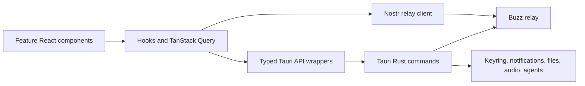

The provider hierarchy starts in
[`desktop/src/main.tsx`](../../desktop/src/main.tsx). Features are grouped under
[`desktop/src/features`](../../desktop/src/features), while reusable API,
layout, hooks, theme, and UI code lives under
[`desktop/src/shared`](../../desktop/src/shared).

Community switching does not reload the page. A community-keyed React subtree
is remounted, and `resetCommunityState()` clears community-scoped module
singletons. Any new module-level cache containing relay/community data must add
a reset there.

The Tauri Rust backend owns native-only work: secure keys, OS integration,
managed agent processes, local archives, voice, terminal processes, and other
capabilities that browser JavaScript cannot safely or portably provide.

### Web

The web application is a separate React/Vite application under [`web`](../../web).
It uses the same relay protocols and broadly the same semantic UI approach, but
does not receive Tauri's native capabilities. The relay can serve its built
bundle as a fallback after API routes are considered.

### Mobile

Mobile features live under [`mobile/lib/features`](../../mobile/lib/features).
Riverpod providers/notifiers own application state; `HookConsumerWidget` and
Flutter Hooks handle local UI lifecycle. Shared relay, model, theme, and widget
code lives under [`mobile/lib/shared`](../../mobile/lib/shared).

Feature modules must not import other feature modules. Cross-feature concepts
belong in `shared`, which prevents the mobile dependency graph from turning
into a web of feature-to-feature coupling.

## 9. Agent lifecycle

The editable diagram is [`agent-lifecycle.mmd`](agent-lifecycle.mmd).

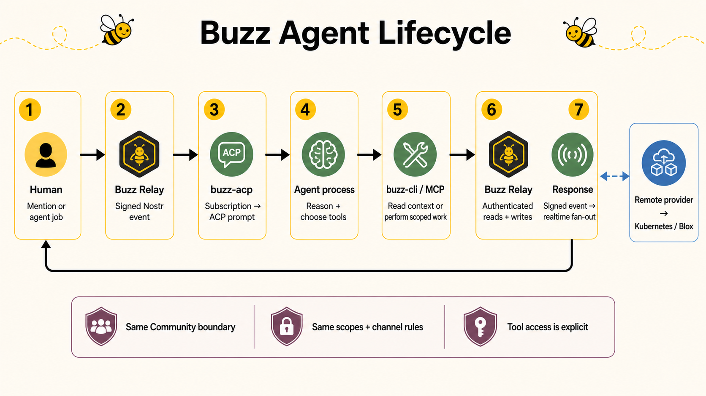

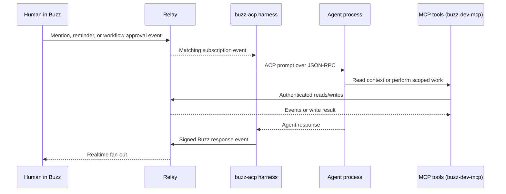

The ACP harness injects relay authentication settings into managed agent
subprocesses. Agent-facing product operations belong in `buzz-cli`; the
developer MCP server is specifically for shell and file tools. Remote agent
providers and lifecycle state are documented in
[`docs/remote-agents.md`](../remote-agents.md).

## 10. Media, Git, huddles, workflows, and pairing

- **Media:** Blossom-compatible upload/download routes validate content and use
  local or S3-backed object storage. Media is HTTP because binary transfer is a
  genuine HTTP-oriented operation.
- **Git:** Git smart HTTP is served through the relay boundary. Nostr credential
  and signing helpers connect Git identity and authorization to Buzz. Object
  storage behavior is detailed in
  [`docs/git-on-object-storage.md`](../git-on-object-storage.md).
- **Huddles:** Room lifecycle is event-driven, while live Opus audio travels on
  a dedicated `/huddle/{channel_id}/audio` WebSocket path.
- **Workflows:** YAML definitions listen for qualifying stored events. Conditions
  use `evalexpr`; execution events are excluded from recursively triggering more
  workflows.
- **Pairing:** `buzz-pair-relay` provides an ephemeral sidecar relay and
  `buzz-pairing-cli` supports device-pairing interoperability.
- **Mesh:** `buzz-relay-mesh` uses Iroh for optional inter-relay mesh transport.

## 11. Deployment topology and repository ecosystem

The editable diagram is [`deployment-ecosystem.mmd`](deployment-ecosystem.mmd).

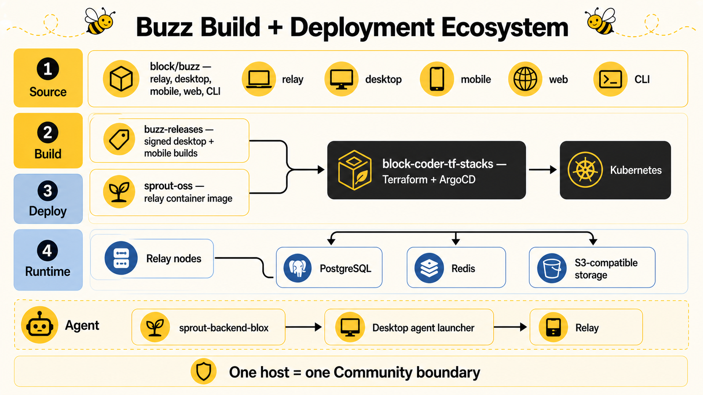

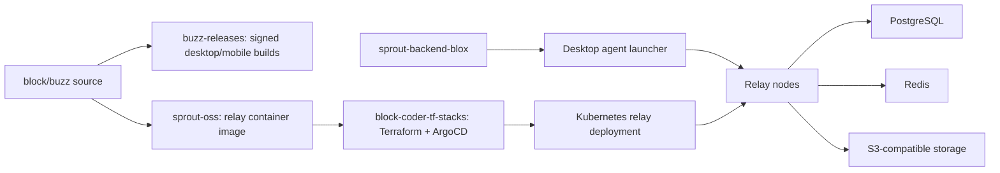

The self-hosted default is one host, one relay, and one implicit community.
Larger deployments can run multiple relay instances behind the same community
host. PostgreSQL provides durable shared state and Redis carries realtime events
between nodes. Kubernetes health probes use the relay's liveness, readiness,
and startup endpoints.

## 12. Reliability, scaling, observability, and operations

### Concurrency and backpressure

The relay bounds connections and concurrent handlers with semaphores. Each
WebSocket has receive, send, and heartbeat work coordinated by a cancellation
token. Outbound messages use bounded channels; consistently slow consumers are
disconnected instead of allowing unlimited memory growth. Audit worker
queues and Git/media concurrency limits protect shared capacity.

### Horizontal scaling

Relay processes are stateless enough to scale horizontally around shared
PostgreSQL, Redis, and object storage. Each process owns its local WebSocket
connections and subscription registry. Redis pub/sub forwards events created on
one instance to subscribers connected to another, while a local-event cache
suppresses Redis echo duplicates.

Short-lived membership, visibility, author-type, and related caches reduce
database load. Cache keys and invalidation messages must include community
scope. A cache is an optimization only; authoritative access decisions remain
grounded in community-scoped data.

### Availability and degradation

| Dependency/problem | Expected effect |
| --- | --- |
| PostgreSQL unavailable | Durable writes and historical queries cannot succeed; readiness should fail |
| Redis unavailable | Cross-node fan-out, presence, replay/rate-limit coordination degrade or fail according to path |
| Object storage unavailable | Media/Git object operations fail without invalidating event history |
| Slow client | Bounded send queue fills and the connection is cancelled after its grace limit |
| Background workflow/audit failure | Primary accepted event remains durable; error is logged/metriced for recovery |
| Relay restart | Clients reconnect, re-authenticate, and replay history through `REQ` |

### Observability

The relay uses structured `tracing`, optional OpenTelemetry OTLP export, and a
separate Prometheus metrics listener. Metrics cover connections, subscriptions,
handler/event paths, queues, database pools, storage, and usage. Logs and spans
should carry operation and community attribution without exposing private keys,
bearer tokens, secret payloads, or unnecessary message content.

Health surfaces distinguish liveness, readiness, and startup. Kubernetes should
use the intended probe rather than treating a process that is alive but cannot
reach required dependencies as ready for traffic.

### Operational checklist

- Configure TLS at the deployment edge and restrict CORS origins.
- Size PostgreSQL pools, relay semaphores, worker queues, and Redis for expected
  connection and event volume.
- Monitor connection counts, slow-client drops, queue saturation, DB pool wait,
  Redis reconnects, event rejection reasons, object-store errors, workflow
  failures, audit queue failures, and partition/storage growth.
- Alert on readiness failures and cross-node pub/sub interruption.
- Create future event and delivery-log partitions before they become hot.
- Define retention for events, logs, audit records, media, Git objects, push
  state, and backups according to product and compliance requirements.
- Exercise database/object-store restore and client reconnect behavior.
- Rotate deployment credentials and revoke API tokens through modeled paths.

## 13. Design system architecture

The editable diagram is [`design-system-layers.mmd`](design-system-layers.mmd).

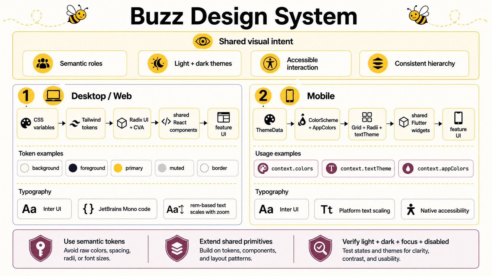

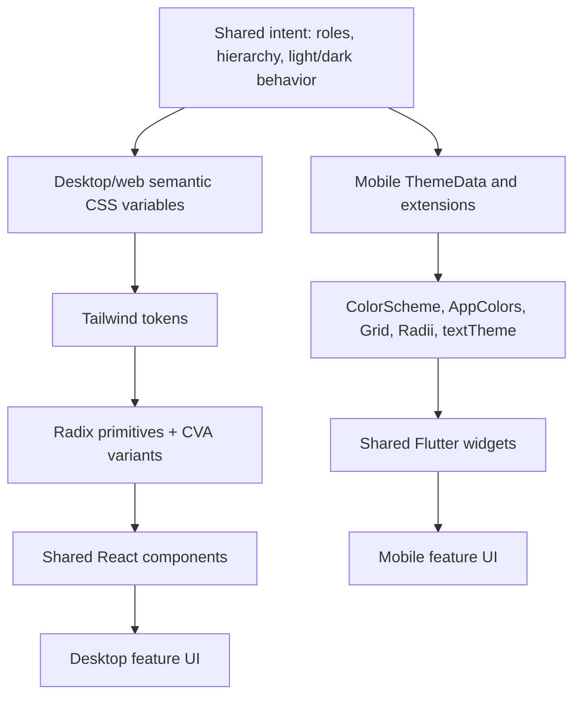

Buzz shares design decisions, not source-level components, between React and
Flutter.

### Desktop and web tokens

The desktop theme starts with semantic roles such as `background`, `foreground`,
`card`, `primary`, `secondary`, `muted`, `accent`, `destructive`, `border`, and
sidebar-specific roles. Tailwind maps utilities such as `bg-primary` and
`text-muted-foreground` to CSS variables. A component asks for a role rather
than embedding a palette color.

The default light and dark foundations are Catppuccin Latte and Macchiato. The
theme engine can also derive the semantic variables from syntax themes and pair
light/dark choices. Community theme preferences are applied by the theme
controller.

Reusable components in [`desktop/src/shared/ui`](../../desktop/src/shared/ui)
combine:

- Radix UI for accessible focus, keyboard, menu, dialog, and popover behavior.
- Tailwind for token-based styling and layout.
- `class-variance-authority` for named component variants and sizes.
- `tailwind-merge` and `clsx` through the shared `cn()` helper.
- Lucide for a consistent icon language.
- Motion and shared CSS animation rules for transitions.

Readable desktop text uses rem-based named tokens so Cmd/Ctrl zoom can scale the
root font size. Arbitrary pixel or arbitrary rem text sizes are rejected by a
repository check. Inter is the interface typeface and JetBrains Mono is used for
code and terminal content.

### Mobile tokens

Mobile constructs `ThemeData` from its theme catalog and exposes semantic values
through `context.colors`, `context.textTheme`, and `context.appColors`.
`AppColors` extends roles not represented by Flutter's standard `ColorScheme`.
`Grid` defines the spacing scale and `Radii` defines reusable corner geometry.
Inter supplies the text ramp, including the 16sp chat base.

The two implementations should agree on meaning and hierarchy even when exact
platform metrics differ. For example, both platforms should use the semantic
primary role for a primary action; they do not need to share a CSS file or the
same widget implementation.

### Extending the design system

1. Search the shared UI/widgets and semantic tokens for an existing role.
2. Extend a shared primitive when the interaction is reusable.
3. Use feature-local composition for feature-specific layout.
4. Add a semantic token only when no existing role describes the intent.
5. Implement and verify light, dark, focus, hover/pressed, disabled, and error
   states as applicable.
6. Use rem-based named text tokens on desktop and `Grid`/`Radii` on mobile.
7. Add component or widget tests; use Playwright screenshots when visual state
   and interaction are important.

## 14. Adding an event-backed feature

Use this as a navigation checklist, not as a substitute for feature-specific
design:

1. Define the operation as a Nostr event when it represents collaborative state.
2. Add the kind to `buzz-core/src/kind.rs` and keep client constants synchronized.
3. Add typed builders to `buzz-sdk` if callers would otherwise hand-build tags
   or content.
4. Add relay validation/handling and preserve the host-derived `TenantContext`.
5. Add a migration and `buzz-db` data access only if the existing event store is
   insufficient.
6. Update thread counters if the new operation inserts replies.
7. Add the agent-facing command to `buzz-cli` when agents need the capability.
8. Add desktop and/or mobile state adapters, then compose the UI from shared
   design-system primitives.
9. Test signature/auth failures, non-membership, idempotency, historical query,
   live fan-out, and community isolation.
10. Update the implementation note and authoritative architecture docs.

## 15. Development and verification

```bash
. ./bin/activate-hermit
cp .env.example .env
just setup
just relay
```

Common gates:

| Change | Minimum focused verification |
| --- | --- |
| Rust core/service | Relevant `cargo test -p <crate>` plus formatting/clippy |
| Relay, DB, or auth | `just test` with PostgreSQL and Redis |
| Desktop | Typecheck, unit tests, and targeted E2E where appropriate |
| Desktop visual state | `pnpm build:e2e` and Playwright/desktop screenshot workflow |
| Mobile | `dart format`, `flutter analyze`, and widget tests |
| Full change before PR | `just ci` |

Activate Hermit before Git or hook-driven commands. The desktop Tauri crate is
outside the root Rust workspace and must be tested with its own manifest.

## 16. Important limitations and tradeoffs

The detailed current list is maintained in
[`ARCHITECTURE.md` section 9](../../ARCHITECTURE.md#9-known-limitations). Important
examples include:

- SQL queries use runtime `sqlx::query()` rather than an offline compile-time
  query cache.
- Admission rate limiting uses Redis, while selected narrower upload/invite and
  observer gates use in-process state; operators must account for which limits
  are cluster-wide versus instance-local.
- Presence can be queried, but there is no dedicated REST query for current
  typers.
- Huddle recording and per-track publishing are reserved but not implemented.
- Workflow approval gates and some workflow actions are not complete end to end.
- Audit and workflows are downstream work; their failures do not roll back an
  already accepted primary event write. Search indexing is inline with the
  insert and cannot diverge from the stored event.

Treat this section as time-sensitive: verify it against the authoritative
architecture document and current code before planning work around a limitation.

## 17. Glossary

| Term | Meaning in Buzz |
| --- | --- |
| ACP | Agent Communication Protocol used between the harness and agent process |
| Blossom | Nostr-oriented HTTP media upload/download protocol |
| Community | Host-selected tenant/workspace and isolation boundary |
| EOSE | End Of Stored Events marker after historical subscription results |
| Event | Signed Nostr record containing kind, tags, content, author, and signature |
| `h` tag | Channel/group scope for an event inside a channel |
| `d` tag | Identifier of a parameterized replaceable/addressable event |
| Kind | Integer identifying the event's operation and lifecycle rules |
| MCP | Model Context Protocol used here for developer tools such as shell/files |
| NIP | Nostr Implementation Possibility: a protocol specification |
| NIP-42 | WebSocket relay authentication challenge flow |
| NIP-98 | Signed HTTP authentication |
| Relay | Authoritative Buzz server accepting, storing, querying, and distributing events |
| Subscription | A client ID plus one or more filters for stored and future events |
| Tauri | Rust-backed native shell hosting the desktop React application |

## 18. Where to go next

- Relay internals: [`ARCHITECTURE.md`](../../ARCHITECTURE.md)
- Contributor workflows: [`CONTRIBUTING.md`](../../CONTRIBUTING.md)
- Testing: [`TESTING.md`](../../TESTING.md)
- Releases: [`RELEASING.md`](../../RELEASING.md)
- Multi-community isolation: [`docs/multi-tenant-relay.md`](../multi-tenant-relay.md)
- Remote agents: [`docs/remote-agents.md`](../remote-agents.md)
- Git object storage: [`docs/git-on-object-storage.md`](../git-on-object-storage.md)
