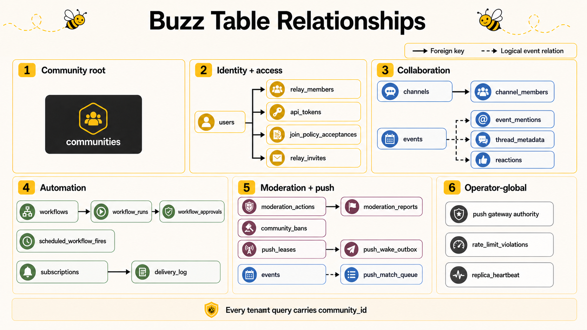

# Buzz Database Table Relations

This document maps the PostgreSQL schema created by [`migrations`](../../migrations).
It complements the conceptual overview in
[`buzz-architecture-and-design-system.md`](buzz-architecture-and-design-system.md)
with physical foreign keys, logical references, tenancy rules, and a complete
table inventory.

The editable grouped diagram is
[`database-table-relations.mmd`](database-table-relations.mmd).

## Reading the schema

- A **physical relation** is enforced by a PostgreSQL foreign key.
- A **logical relation** is maintained by application/trigger behavior but is
  not declared as a foreign key.
- Most product tables are tenant-scoped. Their keys begin with `community_id`.
- Some deployment-wide tables are explicitly registered in
  `_operator_global_tables` and must not be exposed through tenant APIs.
- Event and delivery partitions are physical child tables, not separate domain
  entities.

## Grouped relationship diagram

```mermaid
flowchart TB
    Communities[(communities)]

    subgraph Identity[Identity and access]
        Users[(users)]
        Members[(relay_members)]
        Allowlist[(pubkey_allowlist)]
        Archived[(archived_identities)]
        Tokens[(api_tokens)]
        Policy[(join_policy_acceptances)]
        Invites[(relay_invites)]
    end

    subgraph Collaboration[Channels and events]
        Channels[(channels)]
        ChannelMembers[(channel_members)]
        Events[(events - monthly partitions)]
        Mentions[(event_mentions)]
        Threads[(thread_metadata)]
        Reactions[(reactions)]
        Watermarks[(parameterized_event_watermarks)]
    end

    subgraph Automation[Automation and delivery]
        Workflows[(workflows)]
        Runs[(workflow_runs)]
        Approvals[(workflow_approvals)]
        Fires[(scheduled_workflow_fires)]
        Subscriptions[(subscriptions)]
        Delivery[("delivery_log - monthly partitions<br/>PK excludes community_id")]
    end

    subgraph Moderation[Moderation]
        Reports[(moderation_reports)]
        Bans[(community_bans)]
        Actions[(moderation_actions)]
    end

    subgraph Push[Community-scoped push]
        Leases[(push_leases)]
        Wake[(push_wake_outbox)]
        Match[(push_match_queue)]
    end

    subgraph Operational[Operational and audit]
        AuditLog[(audit_log - hash chain)]
        RateLimit[(rate_limit_violations - global)]
        GitRepos[(git_repo_names)]
        Feedback[(product_feedback)]
        Heartbeat[(replica_heartbeat - single row)]
    end

    PushGateway["push_gateway_* tables<br/>(6 tables, non-tenant-scoped,<br/>own migration set in buzz-push-gateway)"]

    Communities --> Users
    Communities --> Members
    Communities --> Allowlist
    Communities --> Archived
    Communities --> Tokens
    Communities --> Invites
    Communities --> Channels
    Communities --> Events
    Communities --> Workflows
    Communities --> Subscriptions
    Communities --> Reports
    Communities --> Bans
    Communities --> Actions
    Communities --> Leases
    Communities --> Match
    Communities --> AuditLog
    Communities --> GitRepos
    Communities --> Feedback

    Users -->|agent_owner_pubkey, self relation| Users
    Users --> Tokens
    Users --> Workflows
    Users --> Subscriptions
    Members --> Policy
    Channels --> ChannelMembers
    Channels --> Workflows
    Channels --> Threads
    Channels --> Reports
    Channels --> Actions
    Workflows --> Runs
    Workflows --> Approvals
    Workflows --> Fires
    Runs --> Approvals
    Runs --> Fires
    Reports -->|action_id| Actions
    Leases --> Wake

    Events -. trigger-enforced event IDs .-> Mentions
    Events -. logical event IDs .-> Threads
    Events -. logical event IDs .-> Reactions
    Events -. insert trigger .-> Match
    Subscriptions -. logical subscription ID .-> Delivery
```

Solid arrows represent declared foreign keys. Dotted arrows represent logical
references without foreign-key enforcement.

## Physical foreign-key relations

All composite relations shown below include `community_id`, so a child row
cannot point to a same-looking identifier in another community.

| Child table/columns | Parent table/columns | Delete behavior and meaning |
| --- | --- | --- |
| `channels.community_id` | `communities.id` | Community owns channel |
| `channel_members.community_id` | `communities.id` | Community attribution |
| `channel_members.(community_id, channel_id)` | `channels.(community_id, id)` | `ON DELETE CASCADE`; membership belongs to channel |
| `users.community_id` | `communities.id` | Community-local profile |
| `users.(community_id, agent_owner_pubkey)` | `users.(community_id, pubkey)` | `ON DELETE SET NULL`; agent owner stays in same tenant |
| `events.community_id` | `communities.id` | Community owns event copy |
| `event_mentions.community_id` | `communities.id` | Community attribution |
| `subscriptions.community_id` | `communities.id` | Community owns persisted subscription |
| `subscriptions.(community_id, owner_pubkey)` | `users.(community_id, pubkey)` | Subscription owner |
| `delivery_log.community_id` | `communities.id` | Community attribution |
| `workflows.community_id` | `communities.id` | Community owns workflow |
| `workflows.(community_id, owner_pubkey)` | `users.(community_id, pubkey)` | Workflow owner |
| `workflows.(community_id, channel_id)` | `channels.(community_id, id)` | Optional workflow channel |
| `workflow_runs.community_id` | `communities.id` | Community attribution |
| `workflow_runs.(community_id, workflow_id)` | `workflows.(community_id, id)` | `ON DELETE CASCADE` |
| `workflow_approvals.community_id` | `communities.id` | Community attribution |
| `workflow_approvals.(community_id, workflow_id)` | `workflows.(community_id, id)` | `ON DELETE CASCADE` |
| `workflow_approvals.(community_id, run_id)` | `workflow_runs.(community_id, id)` | `ON DELETE CASCADE` |
| `scheduled_workflow_fires.community_id` | `communities.id` | Community attribution |
| `scheduled_workflow_fires.(community_id, workflow_id)` | `workflows.(community_id, id)` | `ON DELETE CASCADE` |
| `scheduled_workflow_fires.(community_id, workflow_run_id)` | `workflow_runs.(community_id, id)` | `NO ACTION`; preserves fire/run provenance |
| `api_tokens.community_id` | `communities.id` | Community owns token |
| `api_tokens.(community_id, owner_pubkey)` | `users.(community_id, pubkey)` | Token owner |
| `thread_metadata.community_id` | `communities.id` | Community attribution |
| `thread_metadata.(community_id, channel_id)` | `channels.(community_id, id)` | Thread stays in same channel/community |
| `reactions.community_id` | `communities.id` | Community attribution |
| `pubkey_allowlist.community_id` | `communities.id` | Community allowlist |
| `relay_members.community_id` | `communities.id` | Community membership |
| `archived_identities.community_id` | `communities.id` | Community-scoped archive state |
| `audit_log.community_id` | `communities.id` | One audit chain per community |
| `git_repo_names.community_id` | `communities.id` | Repository names are unique per community |
| `moderation_reports.community_id` | `communities.id` | Community owns report |
| `moderation_reports.(community_id, channel_id)` | `channels.(community_id, id)` | Optional channel provenance |
| `moderation_reports.(community_id, action_id)` | `moderation_actions.(community_id, id)` | Resolution action must be same-community |
| `community_bans.community_id` | `communities.id` | Community restriction row |
| `moderation_actions.community_id` | `communities.id` | Community owns action |
| `moderation_actions.(community_id, channel_id)` | `channels.(community_id, id)` | Optional channel provenance |
| `parameterized_event_watermarks.community_id` | `communities.id` | Community-scoped NIP-33 replay watermark |
| `push_leases.community_id` | `communities.id` | Community-scoped installation lease |
| `push_wake_outbox.community_id` | `communities.id` | Community-scoped durable outbox |
| `push_wake_outbox.(community_id, author, installation_id)` | `push_leases.(community_id, author, installation_id)` | Wake must belong to an existing lease |
| `product_feedback.community_id` | `communities.id` | Provenance; table is operator-visible across tenants |
| `push_match_queue.community_id` | `communities.id` | Accepted event's durable push-match job |
| `join_policy_acceptances.(community_id, pubkey)` | `relay_members.(community_id, pubkey)` | `ON DELETE CASCADE`; evidence follows membership |
| `relay_invites.community_id` | `communities.id` | Community owns invite |
| `push_gateway_delegations.installation_id` | `push_gateway_installations.id` | Deployment-global installation delegation |

## Logical relations without foreign keys

These are intentional schema relationships but PostgreSQL does not enforce them
as FKs. Code touching them must always carry the full community context.

| Table/column | Logical target | Why it matters |
| --- | --- | --- |
| `events.channel_id` | `channels.id` in the same community | Event table is partitioned and event/channel lifecycle uses soft deletion |
| `event_mentions.(event_id, event_created_at)` | `events.(id, created_at)` in the same community | Denormalized mention index; joins must include `community_id` |
| `thread_metadata.event_id` | `events.id` | Materialized thread projection |
| `thread_metadata.parent_event_id` | `events.id` | Parent edge; nullable |
| `thread_metadata.root_event_id` | `events.id` | Root edge; nullable |
| `reactions.event_id` | Target `events.id` | Materialized active reaction state |
| `reactions.reaction_event_id` | Source `events.id` | Idempotency/provenance |
| `workflow_runs.trigger_event_id` | `events.id` | Workflow trigger provenance |
| `delivery_log.subscription_id` | `subscriptions.id` | Historical delivery record survives independently |
| `delivery_log.event_id` | `events.id` | Delivery provenance |
| `api_tokens.channel_ids` | Set of `channels.id` values | JSONB channel claims; authorization validates scope |
| `community_bans.pubkey` | Community identity/member pubkey | Restrictions can outlive a profile row |
| `pubkey_allowlist.pubkey` | Community identity pubkey | Admission policy independent of profile creation |
| `archived_identities.pubkey` | Community identity pubkey | Archive evidence independent of active user row |
| `git_repo_names.owner_pubkey` | Community identity pubkey | Ownership/quota key stored in wire form |
| `audit_log.actor_pubkey` | Acting identity pubkey | Immutable audit attribution |
| `moderation_*` pubkey/event fields | Users/events in same community | Targets may be absent, deleted, or external evidence |
| `parameterized_event_watermarks.event_id` | Historical event tuple | Retains ordering proof after payload retention cleanup |
| `push_leases.source_event_id` | Lease event | Lease source and replay ordering |
| `push_wake_outbox.event_id` | Event causing notification | Unique endpoint/event delivery key |
| `push_match_queue.event_id` | Accepted `events.id` | Enqueued by an `AFTER INSERT` trigger in the event transaction |
| `product_feedback.event_id` | Signed feedback source event | Feedback is sidecarred rather than stored in normal events |

## Complete table inventory

### Tenant/domain tables

| Area | Tables |
| --- | --- |
| Tenant registry | `communities` |
| Channels and identities | `channels`, `channel_members`, `users`, `relay_members`, `pubkey_allowlist`, `archived_identities`, `join_policy_acceptances`, `relay_invites` |
| Events and projections | `events`, `event_mentions`, `thread_metadata`, `reactions`, `parameterized_event_watermarks` |
| Subscriptions | `subscriptions`, `delivery_log` |
| Workflows | `workflows`, `workflow_runs`, `workflow_approvals`, `scheduled_workflow_fires` |
| Authorization and audit | `api_tokens`, `audit_log` |
| Moderation | `moderation_reports`, `community_bans`, `moderation_actions` |
| Git and feedback | `git_repo_names`, `product_feedback` |
| Community push | `push_leases`, `push_wake_outbox`, `push_match_queue` |

### Deployment-global operational tables

| Table | Purpose |
| --- | --- |
| `_operator_global_tables` | Explicit allowlist and rationale for non-tenant tables |
| `rate_limit_violations` | Deployment abuse/health observations; `community_id` is attribution only |
| `push_gateway_challenges` | One-time public push-gateway challenges |
| `push_gateway_installations` | Device installation and encrypted endpoint authority |
| `push_gateway_delegations` | Relay-to-installation delegations |
| `push_gateway_endpoint_quotas` | Endpoint abuse ceilings |
| `push_gateway_delivery_auth_replays` | Signed delivery-auth replay claims |
| `push_gateway_delivery_request_replays` | Stable request-ID replay claims |
| `replica_heartbeat` | Single-row writer/reader freshness token and epoch |

`product_feedback` is also registered as operator-global for visibility, while
retaining a foreign key to `communities` as provenance.

### Physical partitions

`events` and `delivery_log` are range-partitioned by their time columns. The
event partitions currently declared by the migrations are `events_p_past`,
`events_p2026_01`, `events_p2026_02`, `events_p2026_03`, `events_p2026_04`,
`events_p2026_05`, `events_p2026_06`, and `events_p_future`. The delivery
partitions are `delivery_log_p_past`, `delivery_log_p2026_03`,
`delivery_log_p2026_04`, `delivery_log_p2026_05`, `delivery_log_p2026_06`, and
`delivery_log_p_future`.

These are storage partitions, not additional entities. Queries should target
the parent table and allow PostgreSQL partition pruning to select children.

## Key cardinalities and uniqueness

- One community has many channels, profiles, events, workflows, and audit rows.
- One channel has many membership rows and events.
- A community has at most one profile per pubkey.
- A channel has at most one membership row per pubkey; removal is soft state.
- An active DM participant hash and NIP-29 group ID are unique within a
  community.
- A workflow has many runs, approvals, and scheduled-fire claims.
- A scheduled fire is unique by community, workflow, and scheduled instant,
  providing an at-most-once claim across relay replicas.
- An API token hash and relay invite hash are unique only within their community.
- An audit sequence and audit hash are unique within a community, forming one
  chain per tenant.
- A push wake is unique per community, endpoint hash, and event ID.
- A Git repository name is unique within its community.

## Safe query rules

1. Start every tenant-visible query from server-derived `TenantContext`.
2. Include `community_id` in point lookups, joins, updates, deletes, conflict
   targets, and cache keys.
3. For event projections, join on community plus every available event identity
   field; never join on bare event ID across tenants.
4. Keep authorization outside `buzz-search`: re-check candidate hits in relay
   context.
5. Use transactions for role/membership changes, reply counters, invite claims,
   workflow claims, and durable outbox transitions.
6. Do not add a tenant table without `community_id NOT NULL`, community-leading
   uniqueness, migration-lint coverage, and cross-community collision tests.
7. Add a table to `_operator_global_tables` only after an explicit security and
   product decision that tenant APIs can never observe it.
